<div align="center">

# 🎮 Achievement Engine

**Steam 全成就攻略工具 · Windows 桌面客户端**

把「这游戏要全成就」变成一条能跟着走完的路线

### ⬇️ [**点这里下载最新版**](../../releases/latest)

</div>

---

> **本仓库只用于发布安装包和配套的攻略搬运工具。** 应用源码不公开，请勿在此仓库寻找代码。
>
> `.claude/skills/achievement-guide-builder/` 是一个独立的辅助工具，不是应用源码的一部分 —— 见下方 [攻略搬运工具](#-攻略搬运工具)。

---

## 📖 这是什么

Achievement Engine 是给 Steam 全成就玩家用的桌面工具。它通过 Steam Web API 读取你的游戏库和成就进度，同时提供一个专门的**图文攻略编辑器**，让你把「哪些成就容易错过、在流程的哪一章、具体怎么拿到」写成一份能边玩边看的攻略。

比起 Steam 自带的成就页和网上现成的攻略，它解决三件事：

- **攻略跟着你的进度走** —— 攻略里的成就和你的解锁状态是同一份数据，哪个拿了哪个没拿一眼可见，不用自己对照
- **截图贴在对应的成就下面** —— 不用在攻略文档和截图文件夹之间来回切
- **知道还差几个** —— 每个章节直接标「已完成 / 总数」，不用自己数

---

## ✨ 主要功能

**Steam 账号集成**
支持 SteamID64 / 个人资料链接 / 自定义用户名登录；一键同步游戏库；单项或批量同步成就数据（图标、描述、解锁状态、全局解锁率）。

**图文攻略编辑器**
章节 → 次级成就两级结构，两级都可拖拽排序和跨章节移动；富文本编辑；截图直接插入正文并可拖动排序、点击看大图；图片上下方可插入**题注**并绑定到该图片；次级成就有分类标签和备注。

**成就分类按游戏独立**
每个游戏一套分类和配色，可随时改名、改色、增删，不同游戏之间互不干扰。

**攻略浏览**
纵向时间线 + 顶部路线图导航；已解锁成就为金色名称 + 图标外圈转动的彩虹环，未解锁的则后退；章节全部完成时描边变金色；一键全部展开 / 折叠。

**多版本攻略**
同一款游戏可以建多套攻略（比如「主线流程版」和「全收集版」），各自独立，互不影响。

**数据导入导出**
攻略导出为 **JSON**，图片以 base64 内嵌，**一个文件就是完整备份**，可以直接再导入回来；导入时会带回对方自定义的分类和配色；另可导出为**独立 HTML** 网页，双击用浏览器打开即可分享阅读。

**游戏库**
排序可选 **按攻略数 / 完成度 / 最近游玩 / 时长 / 名称**，默认按攻略数 —— 写过攻略的游戏排在前面；封面取不到时自动降级重试，Steam 刚上架的新游戏也能显示。

**深色 / 浅色主题**
设置 → 外观，两套配色随时切换、立即生效。浅色模式不是简单地把背景刷白 —— 原本的霓虹配色在白底上几乎没有对比度，六个强调色全部换成了同色相压暗、达到可读线的版本。

**自动检查更新**
启动时静默检查一次，有新版本才提示；也可以到「设置 → 关于 → 检查更新」手动查。只提示、不自动安装。

**Ctrl + 滚轮缩放**
和浏览器一样，`Ctrl + 0` 恢复 100%，缩放档位会被记住。

**攻略悬浮窗**
把攻略或编辑器单独丢在屏幕上，边玩边看、边玩边截图，不用在游戏和主窗口之间来回切。鼠标移开自动收起成屏幕边一条，移回去再滑出来；也可以「钉住」让它一直浮着。打开时主窗口自动最小化，关掉再恢复。

**容易错过的成就**
攻略里那些「过了这村没这店」的条目有了专门的位置：攻略页顶部列出成就名、所在章节和错过原因，攻略里每条成就旁挂一个金色「易错过」标签；编辑器里在分类下拉旁一键标记。

**导出成就列表**
游戏详情页可把 Steam 的成就导出成 JSON（apiName、名称、描述），配合下面的攻略搬运工具使用。

---

## ⬇️ 下载安装

**系统要求**：Windows 10 / 11 64 位

当前最新版本 **v0.6.0**（2026-09-19）—— 见 [更新日志](#-更新日志)。

到 [**Releases 页面**](../../releases/latest) 下载最新的安装包：

| 文件 | 说明 |
| --- | --- |
| `Achievement.Engine.Setup.x.x.x.exe` | 安装版：可自选安装目录，自动创建桌面和开始菜单快捷方式 |

> 文件名里的点号是 GitHub 上传时把空格替换掉的结果，下载下来直接双击安装即可。

---

## 🚀 第一次使用

登录页是**两步**，按顺序做完即可。

### ① 设置 Steam Web API Key

首次启动时登录页会先要 API Key：

* 点页面上的 **steamcommunity.com/dev/apikey** 链接（会在浏览器里打开）
* 登录 Steam 后申请，域名随便填（比如 `localhost`）

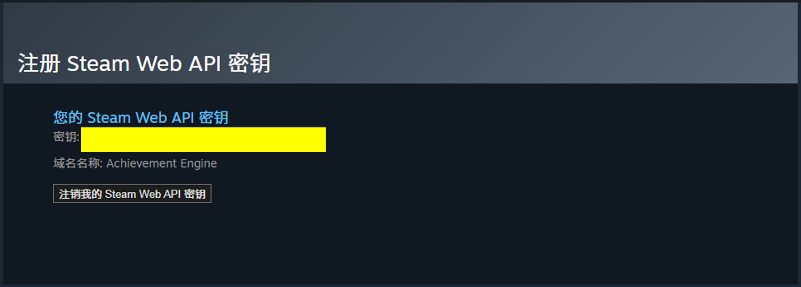

* 把黄色方块区域的 32 位字符**粘贴进输入框**，点「保存」

> 以后想换 Key：侧边栏 **设置 → Steam Web API Key**，或者登录页右上角的「更改 API Key」。

### ② 登录你的 Steam 账号

Key 填好之后，第二步出现：

- 输入 **SteamID64**（17 位数字）**或** Steam 个人资料链接，点「登录」
- 不确定 ID 在哪？点 **「打开我的 Steam 个人资料」** 按钮，浏览器打开登录Steam后，浏览器地址栏（图中黄色方块位置）里的那串数字就是，全选复制粘贴至软件即可

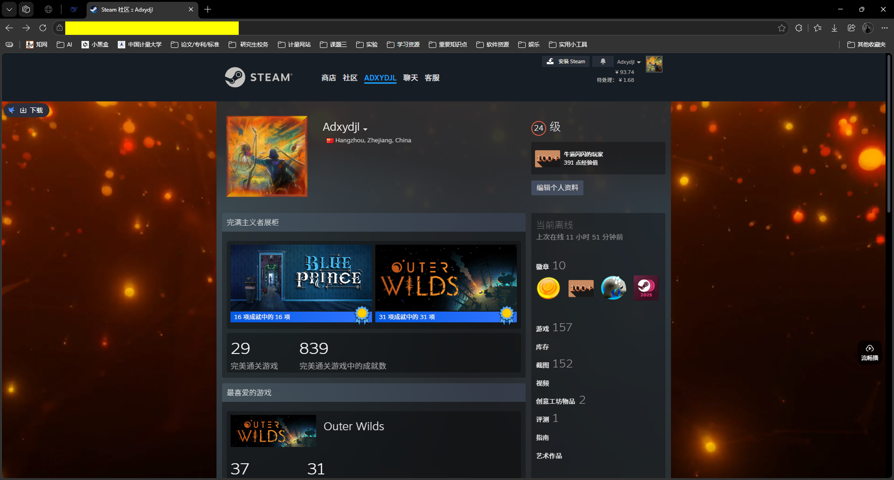

- 如果本机装过 Steam 并且登录着，应用会**自动检测到你的 Steam ID**，直接点登录即可

> **同步失败或成就列表是空的？** 先确认 Steam 个人资料里的「游戏详情」是**公开**的。这是最容易踩的坑 —— 非公开资料下 Steam 不返回任何成就数据。改完设置后需要重新同步。

---

## 🖥️ 界面总览

左侧一条侧边栏，可以拖拽调宽度、也可以折叠成图标：

- **游戏库** —— 主页面
- **设置** —— 弹出设置窗（不是跳页面）

顶部还有两个全局快捷键行为：`Ctrl + 滚轮` 缩放界面，`Ctrl + 0` 恢复 100%。

---

## 🎮 游戏库

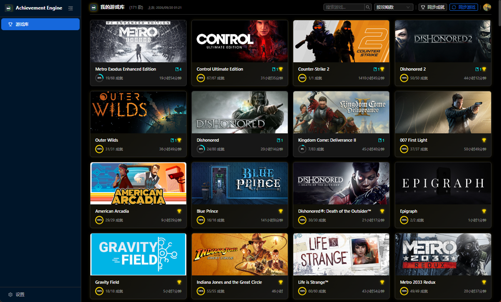

进入应用的首屏，把你 Steam 库里玩过的游戏列成卡片。

### 同步

顶部有两个按钮：

| 按钮               | 作用                                                                                                     |
| ------------------ | -------------------------------------------------------------------------------------------------------- |
| **同步游戏** | 从 Steam 重新拉取游戏库列表（名称、时长、封面）                                                          |
| **同步成就** | 拉取成就数据。点开有两个选项：**增量同步**（只同步玩过的游戏）/ **全量同步**（同步所有游戏） |

首次使用先「同步游戏」拿到库，再「同步成就」拉成就。之后按需增量同步即可。

> 同步成就是逐个游戏请求 Steam 接口的，游戏多时会花一些时间，窗口顶部**任务栏图标会显示进度**。中途可以停。

### 搜索与排序

- **搜索框** —— 按游戏名过滤
- **排序** —— 五种方式：

  | 选项                       | 含义                   |
  | -------------------------- | ---------------------- |
  | **按攻略数**（默认） | 写过攻略的游戏排在前面 |
  | 按完成度                   | 成就解锁百分比         |
  | 最近游玩                   | 按最后游玩时间         |
  | 按时长                     | 按总游戏时长           |
  | 按名称                     | 字母序                 |

### 卡片

每张卡片显示封面、游戏名、游戏时长和一条成就进度条。**封面取不到时会自动降级重试**（常规地址 → 备用地址 → 直接问 Steam 商店接口），所以刚上架的新游戏也能显示。

---

## 🏆 游戏详情与成就

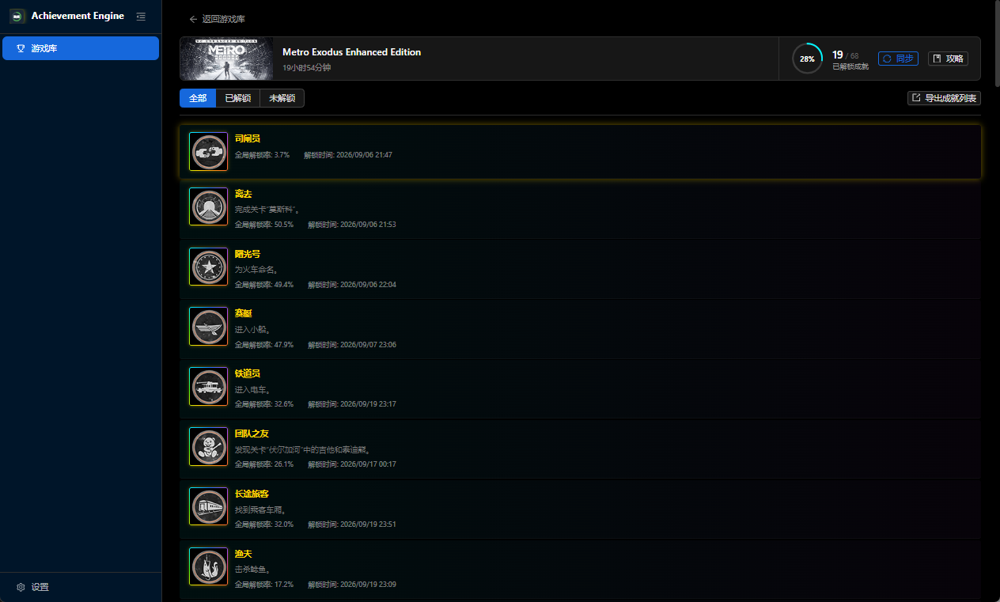

点任意一个游戏封面进入。

### 顶部

- **封面** —— 取自 Steam，会按窗口高度在横版和竖版之间自动切换
- **进度环** —— 解锁百分比；全成就时变成金色
- **同步** —— 只重新拉这个游戏的成就数据
- **攻略** —— 进入这个游戏的攻略页

### 成就列表

- **筛选** —— 全部 / 已解锁 / 未解锁
- 每一条显示图标、名称、描述、**全局解锁率**和**解锁时间**
- **已解锁**的成就：名称金色，图标外圈是一道**转动的彩虹环**，鼠标悬停有金色光晕
- **未解锁**的成就：图标灰化、名称后退

---

## ✏️ 攻略编辑器

这是这个工具最主要的部分。

入口：游戏详情页 →「攻略」→ 新建，或在攻略页点「编辑攻略」。

### 两级结构

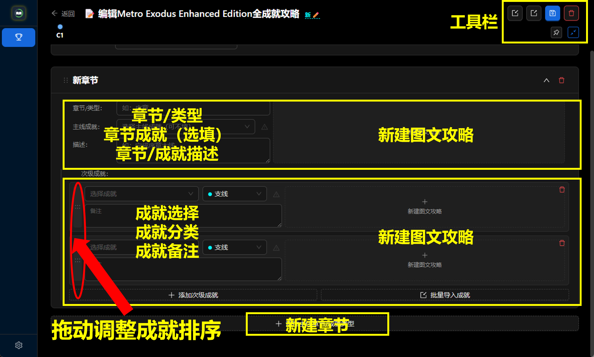

```
章节（第一条主线）
 ├─ 主线成就   —— 这一章的代表成就，可不填
 ├─ 描述       —— 标题下方常驻的一行小字
 ├─ 富文本正文 —— 整章的图文攻略，点击展开
 └─ 次级成就（若干条）
     ├─ 成就   —— 从本游戏的成就里选
     ├─ 分类   —— 决定名字前面那个彩色圆点
     ├─ 备注   —— 成就名下方常驻的一行
     └─ 富文本 —— 这条成就的详细图文
```

**章节可以拖拽排序**，**次级成就可以拖到别的章节**（右键次级成就卡片左侧手柄 →「移至：某章」）。

### 章节

- **章节/类型** —— 章节标题，比如「第一章 序章」
- **主线成就** —— 下拉选一个成就作为本章代表，会在章节顶部单独显示并带图标。没有就留空
- **描述** —— 常驻在标题下方，适合放本章要点

### 次级成就

每一行左边是三个字段（成就下拉 / 分类下拉 / 备注框），右边是图文编辑器。

**批量导入成就**：章节底部的按钮，可以一次勾选多个成就塞进本章：

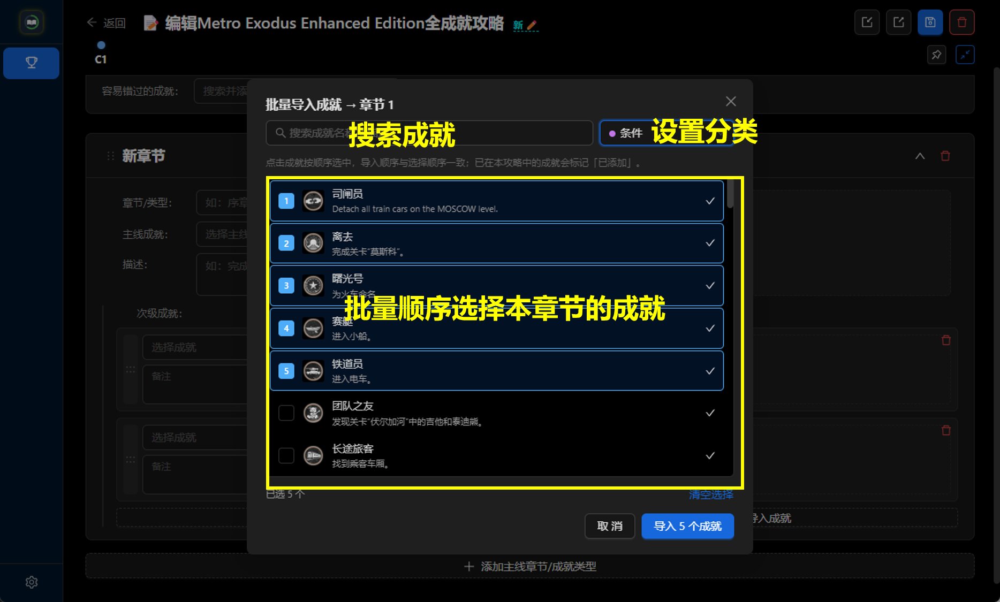

- 点击按顺序选中，**导入顺序 = 选择顺序**
- 可以统一指定分类
- 已经在攻略里的成就会标记「已添加」

导入时会把 Steam 的描述自动填进备注 —— 之后改成自己的话即可。

### 图片

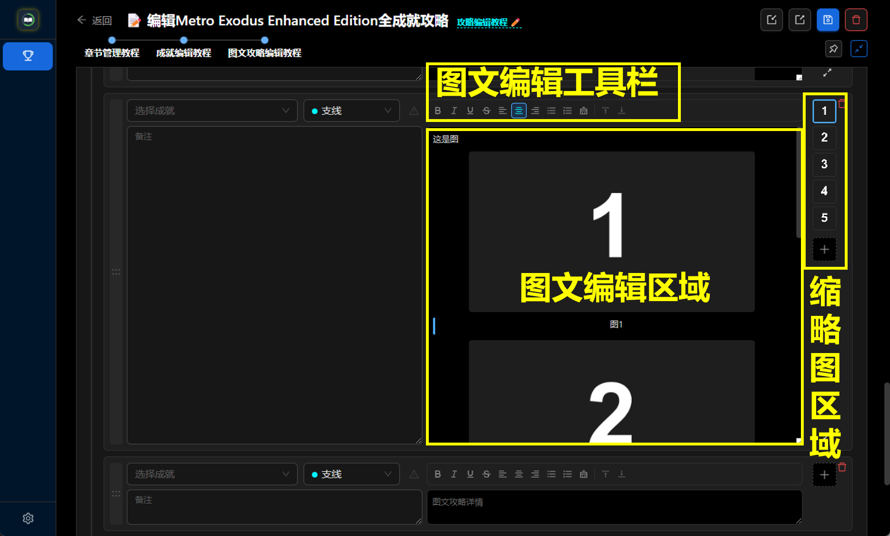

图文编辑器支持三种插图方式：

1. **粘贴** —— 截图后直接 `Ctrl + V`
2. **上传** —— 工具栏的图片按钮，从磁盘选
3. **拖入** —— 直接把图片文件拖进编辑区

图片插进正文后，**右侧的缩略图条**会同步列出本章所有图片：

- 拖动缩略图可以**调整图片顺序**
- 点缩略图会**滚动正文到那张图**并高亮
- 每张图上下可以加**题注**，题注会和图片绑定、一起移动

> 图片以 base64 内嵌在正文里。换来的是**单文件完整备份**：导出的攻略自带所有图片，不会丢、可以直接再导入。

### 分类与配色

每个分类有一个名字和一个颜色，决定成就名字前面那个圆点。

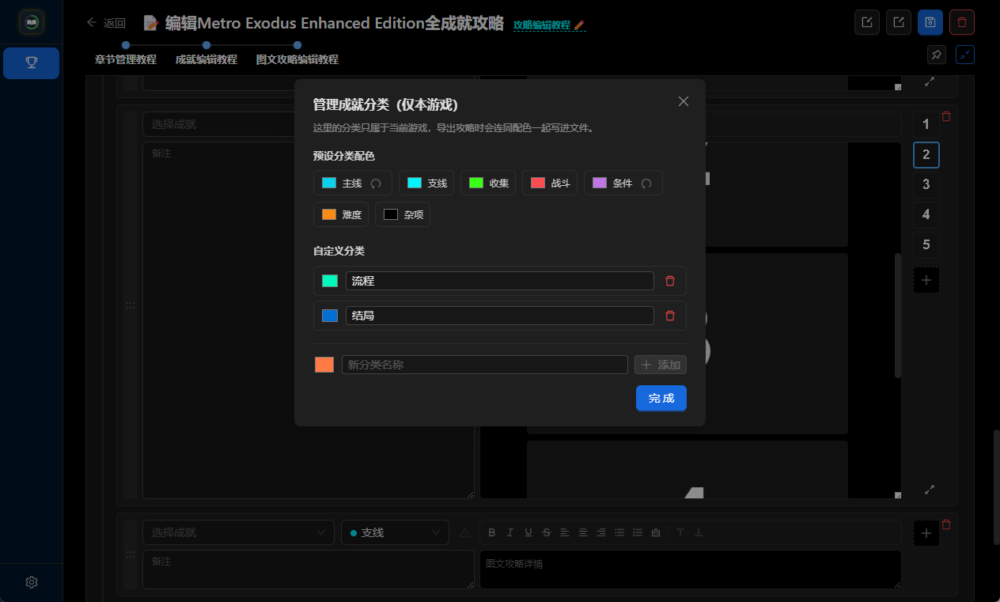

**七个内置分类**：主线 / 支线 / 收集 / 战斗 / 条件 / 难度 / 杂项。

**分类按游戏独立** —— 每个游戏一套自己的分类和配色，互不干扰。

改分类：任何一个分类下拉的底部有「管理分类」，可以新建、改名、改色、删除；也可以点内置分类后面的色块覆盖它的默认色。

也可以**直接在下拉框里输入一个新名字**，回车就创建。

### 容易错过的成就

攻略里那些「过了这村没这店」的条目，单独列在攻略页顶部。

**怎么标记**：每个成就行的分类下拉旁边有一个 ⚠ 按钮，点一下变金色 —— 该成就就被标为「容易错过」，同时自动带出它所在的章节。

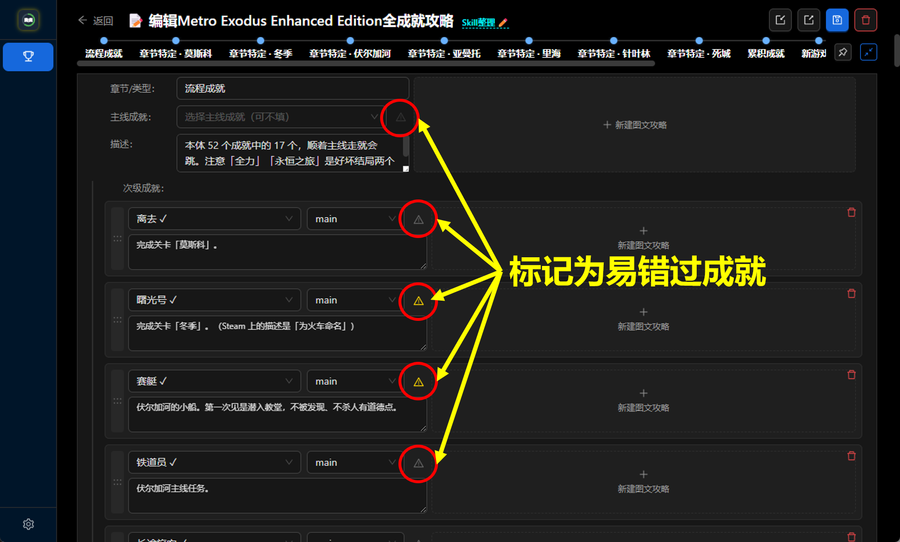

标记后的效果：

- **攻略页顶部**出现一栏，列出成就名、所在章节和原因
- **攻略里那条成就的名字旁**出现一个金色「易错过」标签

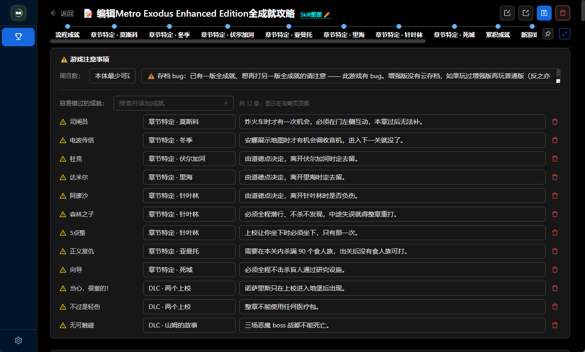

**写原因**：顶部那一栏里每条都可以编辑章节和原因。原因写清楚为什么容易错过，比如「第一章拒绝界外魔印记，接受之后这条就作废」。

### 多个攻略版本

同一款游戏可以建多套攻略，比如「主线流程版」和「全收集版」，各自独立互不影响。顶部有版本下拉可以切换，也可以新建。

### 保存

- **`Ctrl + S`** 手动保存
- **自动备份** —— 每次保存都会往「攻略仓库」目录（设置界面选择路径）写一份 JSON

---

## 📖 攻略浏览页

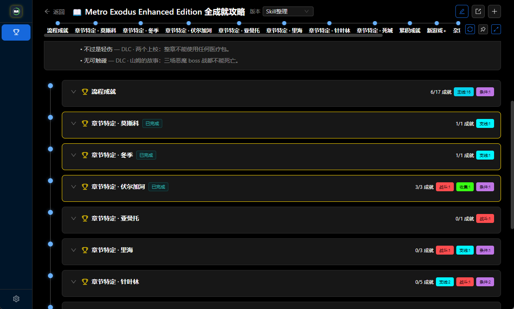

从游戏详情页点「攻略」进入，选择阅读不同版本攻略。

### 顶部固定栏

- **返回游戏库**、游戏名、**版本选择**（多版本时）
- 右侧按钮：
  - **编辑攻略** —— 进编辑器
  - **导出 HTML** —— 导出一个独立网页（见下方「导出 HTML」）
  - **新建版本**

### 线路图

一行章节节点，**鼠标滚轮可以横向滚动它**。点击某个节点会跳转到对应章节，目标卡片停在顶栏下方。

### 注意事项卡片

封面和「周目」「提示」并排，下面是通栏的「易错过」列表。三段各有一个高亮标签。

- **周目** —— 二周目 / 存档继承相关说明
- **提示** —— 通用技巧、难度建议
- **易错过** —— 见「容易错过的成就」一节

### 章节卡片

一章一张大卡片，可以单独折叠展开章节内的成就，右上角有「全部展开 / 折叠」。

一个成就一个卡片，标识成就信息，有图文攻略时，点击卡片弹出图文攻略。

**已解锁的成就**照样是金色名称 + 图标彩虹环；**章节全部完成**时卡片描边变金色，标题旁出现「已完成」标签。

---

## 📌 两个悬浮窗

两个都是**把内容单独丢在屏幕上**，让你边玩边看 —— 不用在游戏和主窗口之间来回切。

**窗口行为（两者相同）**：

- **无边框**，整条顶栏都能拖动
- **贴着屏幕边缘自动收起** —— 鼠标移开就滑到边缘只剩一条，移回去再滑出来
- **钉住** —— 不想让它收就钉住，一直浮着
- **右下角可拖大小**
- 打开时**主窗口自动最小化**，关掉再恢复

### 攻略悬浮窗

入口：攻略页路线图那一行的 **📌 悬浮攻略** 按钮。

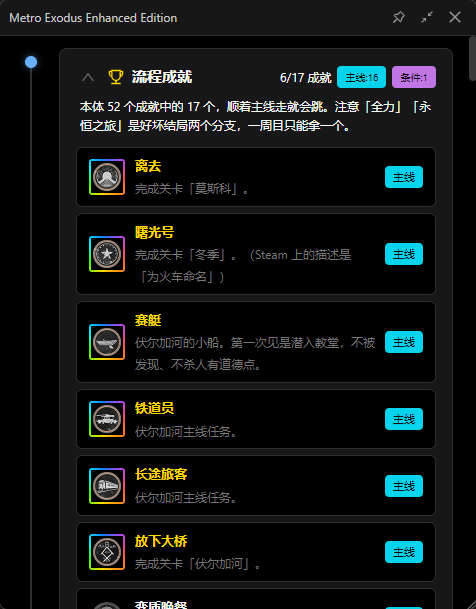

整份攻略变成一个小窗，边玩边查。

### 悬浮编辑窗

入口：编辑器的路线图行、或工具栏的 **📌 悬浮编辑** 按钮。

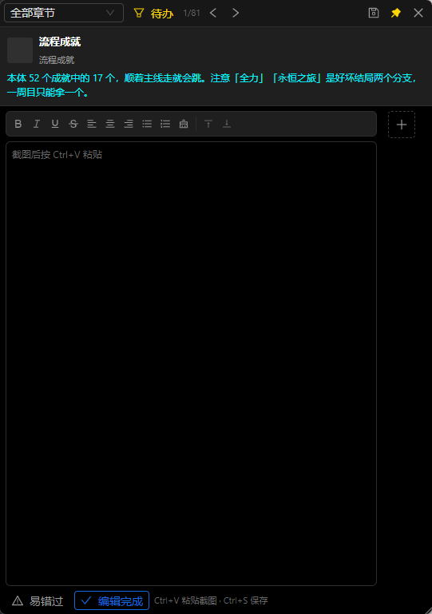

用法是**边玩边截图**：按章节一条条过，遇到要补的当场写、当场 `Ctrl + V` 粘图。

- **按章节导航** —— 上一条 / 下一条
- **筛选** —— 待办 / 全部 / 完成
- **编辑完成** —— 标记这条不用再补了，并自动跳下一条
- **`Ctrl + S`** 手动保存一次并写入攻略仓库

> **为什么「完成」要手动标记？** 一开始想的是「写过内容就算完成」，但实际用下来，贴上第一张截图往往离完成还远 —— 那恰恰是最不该标完成的时候。所以改成由你来判断。

---

## 📤 导入导出

### 攻略 JSON

**导出**：编辑器工具栏的 **导出攻略** 。产出一个 JSON 文件，图片以 base64 内嵌 —— **一个文件就是完整备份**。

**导入**：同一个工具栏的 **导入攻略**。鼠标悬停能看到提示。

- 会带回对方自定义的**分类和配色**
- 本游戏已有的同名分类**保留原有配色**，只新增没有的
- 文件里没有的字段会自动补默认值

适合：备份、换电脑、把自己的攻略发给别人。

### 导出 HTML

攻略页工具栏的 **导出 HTML**。产出一个独立网页文件，双击用浏览器打开就能读。

- **图片已内嵌**，无需附带其他文件夹
- 顶部有章节导航，可以点击跳转
- 带「展开图文攻略」的折叠块
- 适合**发给没装这个软件的人**

两个保存方式：

| 按钮                 | 说明                               |
| -------------------- | ---------------------------------- |
| **另存为**     | 自选路径和文件名                   |
| **选择文件夹** | 用自动生成的文件名，存进指定文件夹 |

### 导出成就列表

游戏详情页的 **导出成就列表** 按钮。产出一份 JSON，含每个成就的 `apiName`、名称和描述。

导出的是 **Steam 给什么就是什么** —— 很多游戏是英文原名。这份文件是**喂给 AI 工具用的输入**，不是给人读的攻略：哪些成就归哪一类，正是要让 AI 从攻略正文里读出来的东西。

### 自动备份

每次保存攻略，都会往**攻略仓库**目录额外写一份 JSON 备份。

仓库位置在 **设置 → 攻略仓库** 里改。默认在 `%APPDATA%\achievement-engine\guides`。

---

## ⚙️ 设置

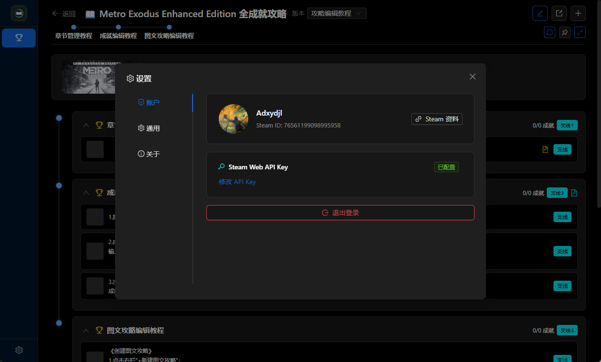

侧边栏点 **设置**，弹出一个设置窗，里面四块：

### Steam Web API Key

填你的 API Key（见上方「第一次使用」）。

### 外观

**深色 / 浅色**两套配色，切换后立即生效。

浅色模式不是简单地把背景刷白 —— 原本的霓虹配色在白底上几乎没有对比度，六个强调色全部换成了同色相压暗、达到可读线的版本。

### 攻略仓库

攻略自动备份存放的文件夹。可以改到别处。

### 关于

显示当前版本号，以及**检查更新**按钮。启动时也会静默检查一次，有新版本才提示。

> **只提示、不自动安装**：安装包未签名，自动更新会触发 Windows 的「未知发布者」警告，装在 `Program Files` 时也没有权限替换自己。点「前往下载」会打开下载页。

### ⚠️ 数据导出（v0.6.0 尚未实现）

设置里的「数据导出」目前会提示「导出功能即将推出」—— **这个功能还没有做完**，请忽略它。游戏库和成就数据的导出，请用游戏详情页的「导出成就列表」。

---

## ⌨️ 快捷键

| 快捷键          | 位置                | 作用           |
| --------------- | ------------------- | -------------- |
| `Ctrl + S`    | 编辑器 / 悬浮编辑窗 | 保存攻略       |
| `Ctrl + V`    | 图文编辑器          | 粘贴截图       |
| `Ctrl + 滚轮` | 全局                | 缩放界面       |
| `Ctrl + 0`    | 全局                | 恢复 100% 缩放 |

---

## 💾 数据存在哪

| 内容 | 位置 |
| --- | --- |
| 数据库（游戏库、成就、攻略全部内容） | `%APPDATA%\achievement-engine\data\achievement-engine.db` |
| 攻略仓库备份 | 你自己指定的文件夹（设置 → 通用 → 攻略仓库） |
| Steam API Key | `%APPDATA%\achievement-engine\config.json` |

卸载软件**不会**自动删除这些数据，需要手动清理。换电脑时把数据库文件复制过去即可。

---

## ❓ 常见问题

**同步失败，或者成就列表是空的？**
先确认 Steam 个人资料里的「游戏详情」是**公开**的，再检查 API Key 有没有填错。改完资料设置后需要重新同步。

**游戏封面加载不出来？**
封面来自 Steam 的 CDN。如果所在网络无法直连 `cdn.cloudflare.steamstatic.com`，封面会显示占位图，不影响其它功能。

**导入攻略后，有几个分类名是乱码？**
v0.3.0 之前的版本在某些情况下会按错误的编码读取文件，导致分类名被存坏。升级到最新版后重新导入即可；如果已经保存过坏掉的名字，在分类管理面板里手动改回来。

**导出的攻略文件怎么这么大？**
图片以 base64 内嵌在正文里，体积约为原图的 1.3 倍。换来的是单文件完整备份、不会丢图、可以直接再导入。

**攻略文件能手动编辑吗？**
可以。就是普通 JSON，用文本编辑器打开就能改。

**杀毒软件报毒？**
安装包未做代码签名（个人项目，签名证书需要付费），部分杀毒软件会对未签名的 Electron 应用误报。可以先把安装包加入白名单再安装。

**隐藏成就的描述是空白的？**
Steam 的成就接口对隐藏成就不下发描述字段。同步时会额外读一次社区统计页补齐 ——《辐射 4》这类成就全是隐藏的游戏，描述现在能补上。

**界面字太小或太大？**
`Ctrl + 滚轮` 缩放，`Ctrl + 0` 恢复 100%。缩放档位会被记住。

**悬浮窗不见了？**
它在贴着屏幕边缘、收起状态下只剩很窄的一条。把鼠标移到那条边上就会滑出来。也可以把主窗口切回来，重新点一次「悬浮攻略」。

**设置里的「数据导出」点了没反应？**
v0.6.0 里这个功能还没做完，会提示「导出功能即将推出」。要导出游戏库和成就数据，请用**游戏详情页的「导出成就列表」**。

---

## 🤖 攻略搬运工具

本仓库里带了一个 **Claude Code skill**，用来把别人写好的全成就攻略搬进这个工具。

网上现成的全成就攻略大多是给人看的：按章节、按难度或者按成就类型组织，格式五花八门。这个 skill 干的事就是读懂它原本的结构，把每个成就按攻略自己的章节归位，生成一份能直接导入的 JSON。

**怎么用**

1. 在游戏详情页点「导出成就列表」，拿到这个游戏的成就清单（JSON）
2. 把攻略正文（网页 / Markdown / 纯文本都行）连同这份清单交给 Claude Code
3. 说一句「用 achievement-guide-builder 整理这份攻略」

**怎么装**

把仓库里的 `.claude/skills/achievement-guide-builder/` 整个复制到：

- 你的项目根目录下的 `.claude/skills/` —— 只在该项目可用
- 或 `%USERPROFILE%\.claude\skills\` —— 任何目录下都能用

**它会做什么**

- 认清攻略原本的组织方式（按章节 / 按类型 / 两者混用），**沿用它的切分**，不另起一套
- 逐成就定位，跨章节的归到首次给出解法的那一章，其余章节在描述里留提醒
- 成就清单是英文时，在每条备注顶部补上中文译名和描述
- 清单里有、攻略没提到的成就单开一章收着，不会漏
- 自带你这份清单做校验，核对每个 apiName 是否真的命中

**它不会做什么**

攻略里的截图带不进来 —— 工具内的图片是内嵌的，只能手动粘贴。遇到原本有图的位置，它会在文字里标出来，你回原帖对照即可。

---

## 🗺️ 开发计划

- [x] Steam 集成、游戏库、成就列表、数据导出
- [x] 攻略编辑与浏览、分类体系、流程时间线、图文攻略、多版本攻略
- [x] 成就进度管理
- [ ] 在线攻略分享

---

## 📝 更新日志

### v0.6.0 — 2026-09-19

**新增**

- **攻略悬浮窗** —— 把攻略单独丢在屏幕上，不用在游戏和主窗口之间来回切。贴着屏幕边缘自动收起、鼠标移上去再滑出来，也可以「钉住」让它一直浮着；大小可拖。打开时主窗口自动最小化，关掉再恢复。
- **悬浮编辑窗** —— 同一个思路的编辑器：按章节一条条过，边玩边截图。改完自动存，`Ctrl + S` 手动存，`Ctrl + V` 直接粘图。
- **导出成就列表** —— 游戏详情页新增按钮，把 Steam 的成就导出成 JSON，含 apiName、名称与描述。导出的是 Steam 给什么就是什么（很多游戏是英文原名），用于下面那个 AI 工具。
- **容易错过的成就** —— 攻略里那些「过了这村没这店」的条目，现在有了专门的位置。攻略页顶部新增一栏列出成就名、所在章节和理由；攻略里每条成就旁挂一个金色「易错过」标签。
- **标记入口** —— 编辑器里可以直接标记：次级成就行和主线成就行的分类下拉旁各有一个 ⚠ 按钮，悬浮编辑窗是底栏一个开关。标记时自动带出该成就所在的章节。
- **攻略搬运工具** —— 见上方 [攻略搬运工具](#-攻略搬运工具)。把现成的全成就攻略连同成就清单交给它，生成能直接导入的攻略 JSON，并自带校验。

**优化**

- **注意事项卡片重排** —— 封面和「周目」「提示」同行，横跨下方的「易错过」列表独立一段。三段各配一个定宽高亮标签，正文左缘对齐。封面不再被一长串易错过警告拽着一起变大。
- **导出的 HTML 跟上了** —— 注意事项卡片改成同样的两段式，并且**补上了游戏封面**（之前导出的 HTML 里没有）。
- **时间线跳转定位** —— 点路线图上的章节，目标卡片会准确地停在顶栏下方。之前偏移量是两个写死的数（220 / 210），顶栏改过之后同时失效；现在跳转时实测顶栏高度，窗口拉窄导致顶栏换行也能对上。
- **路线图支持滚轮** —— 悬停在章节路线图上时，普通滚轮横向滚动它。滚到头之后放行给页面，不会把人卡在那儿。
- **封面尺寸统一** —— 游戏成就列表页的顶栏封面改为 16:9 / 2:3 自适应，和游戏库卡片走同一条选择逻辑。
- **缩略图排布统一** —— 章节图文编辑的缩略图也改成竖列，全项目一致。
- **悬浮按钮归位** —— 「悬浮攻略」「悬浮编辑」移到路线图那一行的右端。它们管的是下面这些章节，和「同步」「全部折叠」同类，不该混在工具栏的文档操作里。

**修复**

- **打开某些攻略会白屏** —— 存档或导入的攻略如果 `game_notes` 里缺 `missable` 字段，攻略页读取时会抛错。现在加载和导入两处都会把缺失的字段补齐。
- **编辑器滚动** —— 滚动过程中内容被拽走；滚到两端后滚轮会带着整个页面走。
- **顶部路线图的横轴线画不出来** —— 测量写成了 effect + ref，在攻略加载完的那一帧拿到的还是空节点，之后再也不会重跑。改为回调 ref。封面「不切换与频闪」是同一个病根，一并修掉。
- **次级成就编辑框的拖动角标** 可以一直往下拖，跑到下层卡片上。
- **布局塌陷** —— 顶栏放大后塌成一条窄列；章节行左栏在半屏宽度下溢出。
- **导入 / 导出图标是反的** —— 用的 `Upload` / `Download`（表达的是网络传输），读起来方向颠倒，而且跟界面里已有的「批量导入成就」自相矛盾。三处统一换成 `Import` / `Export` 配对图标。

### v0.5.0 — 2026-09-16

**新增**

- **深色 / 浅色主题** —— 设置 → 通用 → 外观，随时切换，立即生效。浅色模式不是把背景刷白就完事：原本的霓虹配色在白底上几乎没有对比度（金色只有 1.4:1），六个强调色因此全部换成了同色相压暗、且达到 4.5:1 可读线的版本。
- **自动检查更新** —— 启动时静默检查一次，有新版本才弹通知；也可以到「设置 → 关于 → 检查更新」手动查。只提示、不自动安装。
- **Ctrl + 滚轮缩放** —— 和浏览器一样，`Ctrl + 0` 恢复 100%，缩放档位会被记住。
- **游戏库新增「按攻略数」排序**，并设为默认 —— 写过攻略的游戏排在前面。

**优化**

- **隐藏成就的描述终于能补全了** —— Steam 的成就接口对隐藏成就不下发描述字段，《辐射 4》这类成就全是隐藏的游戏，描述会整片空白。现在同步时会额外读一次社区统计页补齐（实测 Outer Wilds 一次补上 24 条）。
- **部分游戏没有封面** —— 新上架的游戏，Steam 把商店素材挪进了带哈希的目录，原来的封面地址取不到。现在按「常规地址 → 备用地址 → 问商店接口」三级降级取，游戏库、成就列表页、攻略页三处统一走同一条链。
- **返回游戏库时的卡顿** —— 之前每次从游戏返回都会重新加载一遍：先闪一下骨架屏、再重建整个网格，而为的是一份根本没变的数据。现在内存里有就直接用；滚出屏幕的卡片也不再参与布局与绘制。
- **编辑器滚轮** —— 缩略图条或编辑区滚到边界后，滚轮不再把整个窗口一起带走。
- **布局更紧凑** —— 攻略页和编辑页的顶栏从 5 行压到 1 行，按钮只留图标（悬停有提示），正文区域整体上移。
- **图文编辑区** —— 章节描述框会吸收编辑框拉高后多余的高度，不再留大片空白；高度调节统一到编辑框右下角一个入口，描述框与备注框两个方向都跟随。
- **题注高亮重做** —— 原本散落的四种蓝色统一成一个强调色；悬停缩略图时，图片和它的上下题注整块一起高亮并滚进视野。
- **成就的显示规则统一** —— 已解锁：成就名金色、图标外圈是一道转动的彩虹环、悬停有金色光晕；未解锁：两者都后退。规则只写在同一个地方，往后各处不会再各配一套色。

**修复**

- 悬停缩略图时滚动的是图片本身，导致带题注的图片上下两条题注都滑出视野 —— 现在滚的是整个图文块。
- 图片条开头有一个不响应任何操作的六点图标，删除。

### v0.4.0 — 2026-09-14

首个公开版本。

---

## ©️ 版权

Copyright © 2026 等心愿都降落 DXYDJL

本项目**未开源**，保留所有权利。软件可免费下载使用，但未经作者许可，不得复制、修改、再分发，或将其用于商业用途。

Steam 是 Valve Corporation 的商标。本软件为第三方非官方工具，与 Valve Corporation 无任何关联。
